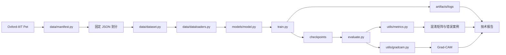

# 系统架构

## 1. 架构目标

保持数据、模型、训练、评估和可视化相互解耦。模块之间通过稳定的数据契约连接，使内部实现可以在不影响其他部分的情况下调整。

## 2. 总体数据流



## 3. 模块职责

| 模块 | 输入 | 输出 | 主要职责 |
| --- | --- | --- | --- |
| `data/manifest.py` | 官方清单 | 固定样本划分 | 下载检查、分层划分和重复性校验 |
| `data/transforms.py` | PIL 图片 | 标准化图片 Tensor | 训练增强与验证/测试确定性处理 |
| `data/dataset.py` | 图片路径与标签 | 单张图片与标签 | 根据 JSON 划分读取样本 |
| `data/dataloaders.py` | Dataset | batch | 创建 train、val、test DataLoader |
| `models/model.py` | 图片 Tensor | 37 类 logits | 加载预训练 ResNet-18 并替换分类头 |
| `train.py` | 配置与数据 | checkpoint、日志 | 组织训练和验证循环 |
| `evaluate.py` | checkpoint、测试数据 | 指标和图表 | 最终评估与结果导出 |
| `utils/metrics.py` | 预测结果与标签 | Accuracy、F1、混淆矩阵 | 计算和绘制评价指标 |
| `utils/gradcam.py` | 图片和模型 | 热力图 | 生成可解释性结果 |

## 4. 数据契约

```text
单个训练样本：
image Tensor [3, 224, 224], label integer

一个 batch：
images [B, 3, 224, 224], labels [B]

ResNet-18 分类输出：
logits [B, 37]

测试评估输出：
Top-1 Accuracy、Top-5 Accuracy、Macro-F1、预测标签
```

## 5. 计划目录

```text
data/
├── manifest.py
├── transforms.py
├── dataset.py
└── dataloaders.py
models/
└── model.py
utils/
├── metrics.py
└── gradcam.py
train.py
evaluate.py
requirements.txt
README.md
docs/
artifacts/
datasets/
```

## 6. 尚待 A1 对齐

- 训练环境与硬件；
- 使用官方划分还是合并后重新分层划分；
- 评价指标的具体计算口径；
- 第一组和第二组消融实验；
- 目标模型选择标准。

在 A1 对齐前，不锁定上述实现细节。
